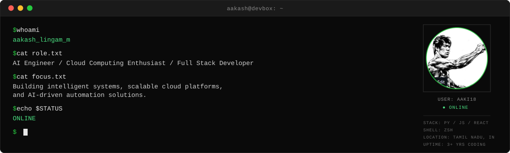
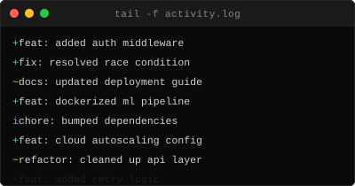
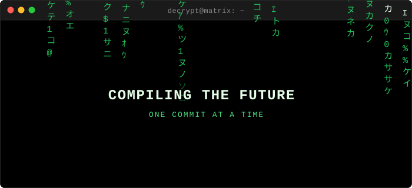

<div align="center">



<br/>


---

<table align="center" width="100%">
<tr>
<td align="center" width="50%" valign="top">

```diff
+ $ cat about.txt

# AI Engineer / Cloud Computing
# Enthusiast / Full Stack Developer

# Building intelligent systems,
# scalable cloud platforms, and
# AI-driven automation solutions.
```

</td>
<td align="center" width="50%" valign="top">

```diff
+ $ cat learning.txt

# > DevOps
# > CI/CD
# > Agentic AI
# > Cloud Architecture

+ $ echo $MISSION
# Ship production-ready AI systems
```

</td>
</tr>
</table>

---

**`$ ls -la experience/`**

<table align="center">
<tr>
<td align="center" width="33%" valign="top">

```diff
! techzarinfo/

# role: React.js Intern

+ UI Development
+ Component Architecture
+ Responsive Design
```

</td>
<td align="center" width="33%" valign="top">

```diff
! internpe/

# role: AI/ML Intern

+ ML Models
+ Data Processing
+ Predictive Systems
```

</td>
<td align="center" width="33%" valign="top">

```diff
! divihn/

# role: ServiceNow AI Intern

+ Enterprise AI
+ Automation Systems
+ Workflow Design
```

</td>
</tr>
</table>

---

**`$ ls -la projects/`**

<table align="center">
<tr>
<td align="center" valign="top" width="33%">

```diff
! healthcare_ai/

+ Hospital 360 Platform
+ Diabetes Prediction
+ EV Battery Health Detection
+ E-Tongue Herb Detection
```

</td>
<td align="center" valign="top" width="33%">

```diff
! ml_prediction/

+ Dynamic Pricing System
+ Car Price Prediction
+ Stock Price Prediction
+ IPL Score Prediction
```

</td>
<td align="center" valign="top" width="33%">

```diff
! ai_systems/

+ Illegal Mining Detection
+ Face Recognition System
+ Crisis Orchestration Engine
+ AI Learning Tracker
```

</td>
</tr>
</table>

---

<table align="center" width="100%">
<tr>
<td align="center" width="50%" valign="top">

**`$ ./tech_stack.sh`**

<br/>

**LANGUAGES**
<br/>


**FRAMEWORKS**
<br/>


**CLOUD & DEVOPS**
<br/>


**AI / DATA**
<br/>


</td>
<td align="center" width="50%" valign="top">

**`$ ./contribution_stats.sh`**

<br/>


<br/>



<br/><br/>

</td>
</tr>
</table>

---

**`$ ./now_playing.sh`**



---

**`$ python3 mission.py`**

```python
while True:
    learn()
    build()
    deploy()
    improve()
```

---

**`$ contact --list`**

<a href="https://www.linkedin.com/in/aakash-lingam-m-9aba4b2a3">

</a>
<a href="mailto:aakashlingam2006@gmail.com">

</a>
<a href="https://github.com/Aaki18">

</a>

<br/><br/>

**`$ exit`**

> `process finished with exit code 0`

</div>
